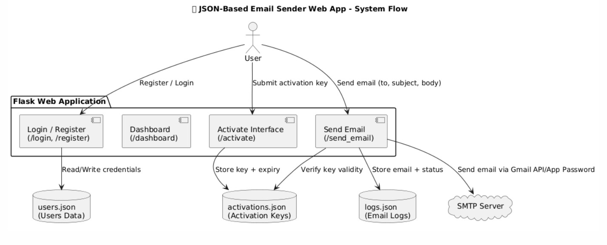
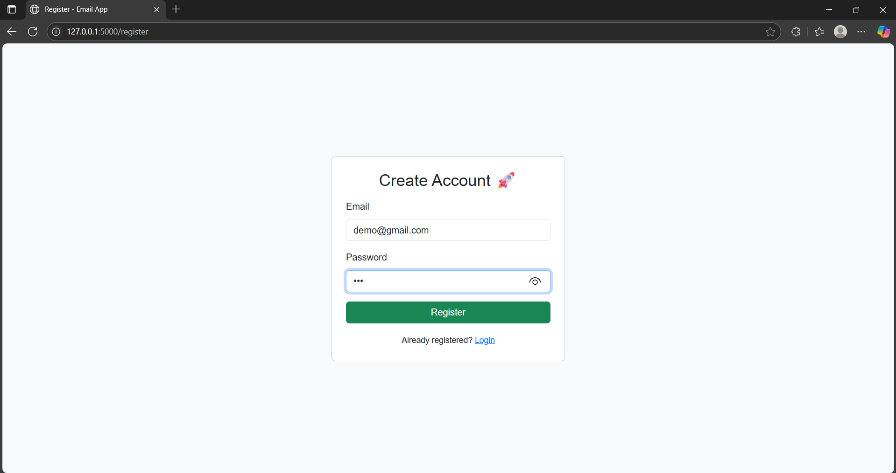
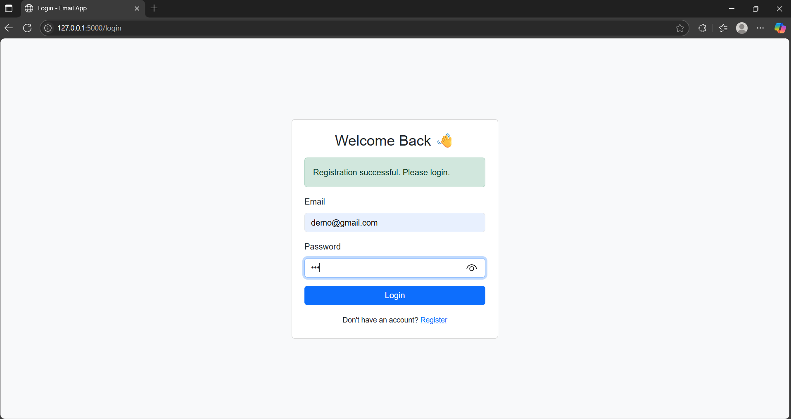
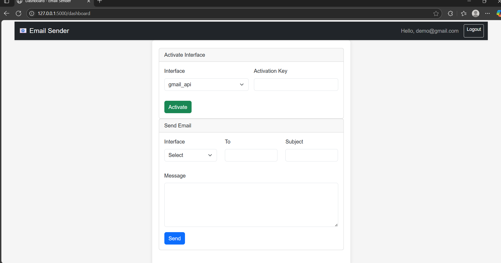

# 📧 Advanced Email Sender Dashboard

A professional, secure email-sending web application developed using **Python (Flask)** and **Bootstrap 5**. This app lets users send emails through different authentication methods like Gmail API, App Passwords, or a customizable mixed-domain SMTP sender.

The system includes login and registration, interface activation with key validation, email logging, and a clean user dashboard. Built without a database — **data is stored securely in local JSON files** — this makes it simple to run and demo.

---

## 🧩 Why This Project Matters

This project is a full-stack solution ideal for showcasing skills in:
- Web development with Python & Flask
- Authentication, sessions, and secure password handling
- Email automation with SMTP
- JSON-based persistence (can be upgraded to database)
- Real-world UI/UX using Bootstrap and CSS
- Interface licensing simulation using activation keys

---

## 📋 Features

- ✅ User Registration & Login with Password Hashing
- 🔐 Interface Activation (each method requires unique key)
- 📧 Send emails using Gmail API, App Passwords, or custom SMTP
- 💾 Logs every email (to, subject, timestamp, interface)
- 🖥️ Elegant UI using Bootstrap 5
- 📁 No database required — JSON used to persist data
- ⚠️ Exceptions are handled cleanly with user-friendly feedback

---


## 🧱 Architecture Diagrams

## 🧱 Architecture Diagrams

<div align="center">

  <table>
    <tr>
      <td align="center">
        <strong>📂 Current Architecture (JSON-based)</strong><br>
        <br>
        <p align="left" style="max-width: 400px;">
          This version uses a fully local file-based architecture. User credentials, activation keys, and email logs are stored in `users.json`, `activations.json`, and `logs.json`. It's simple, fast to prototype, and perfect for demo projects without needing a backend database. The app simulates licensing via activation keys and sends emails using an SMTP server like Gmail.
        </p>
      </td>
      <td align="center">
        <strong>🔮 Future Architecture (DB + Auth Layer)</strong><br>
        <br>
        <p align="left" style="max-width: 400px;">
          The future-ready system upgrades to a real-world structure with PostgreSQL/MySQL for persistent data storage. An authentication service validates credentials and sessions. Activation and email logs are stored in structured tables. This design supports better scalability, security, and easier integration with admin dashboards or analytics tools.
        </p>
      </td>
    </tr>
  </table>

</div>


## 📁 Folder Structure

```
email_sender_advanced/
├── app.py
├── activations.json
├── users.json
├── logs.json
├── templates/
│   ├── login.html
│   ├── register.html
│   └── dashboard.html
├── static/
│   └── style.css
```

---

## 🛠 Technologies Used

- **Backend**: Python, Flask
- **Frontend**: HTML5, CSS3, Bootstrap 5
- **Email**: `smtplib`, `email.mime`
- **Security**: Werkzeug password hashing, Flask sessions
- **Data Storage**: JSON files (acts like a flat-file database)

---

## 🚀 Getting Started

### 🔧 Installation

1. Clone this repository:
```bash
git clone https://github.com/ASN07S/email_sender.git
cd email_sender_advanced
```

2. Install dependencies:
```bash
pip install flask
```

3. Run the app:
```bash
python app.py
```

Open your browser and go to `http://127.0.0.1:5000`

---

## 💡 Future Upgrades (Optional)

While this app works perfectly with JSON, you can scale it up:

| Feature | Upgrade Option |
|---------|----------------|
| User data | Use SQLite + SQLAlchemy ORM |
| Email logs | Store in DB with timestamps & search |
| Secret management | Use `.env` files & `python-dotenv` |
| Structure | Move to Flask Blueprints |
| Deployment | Host on Render, Replit, or Docker |

---

## 📸 Screenshots

<div align="center">

  <table>
    <tr>
      <td align="center">
        <strong>🔐 Register Page</strong><br>
        
      </td>
      <td align="center">
        <strong>🔐 Login Page</strong><br>
        
      </td>
    </tr>
    <tr>
      <td colspan="2" align="center">
        <strong>🏠 Dashboard with Interfaces</strong><br>
        
      </td>
    </tr>
  </table>

</div>

## 🧠 Use Cases

- Client work where you need an activation-based license demo
- Email automation tools with minimal setup
- Flask learning or internship/college portfolio projects
- JSON-based tools with full stack control

---

## 🪪 License

MIT License — use it, modify it, ship it freely 🚀

---

## 👤 Author

Made with ❤️ by Abhishek 


---
